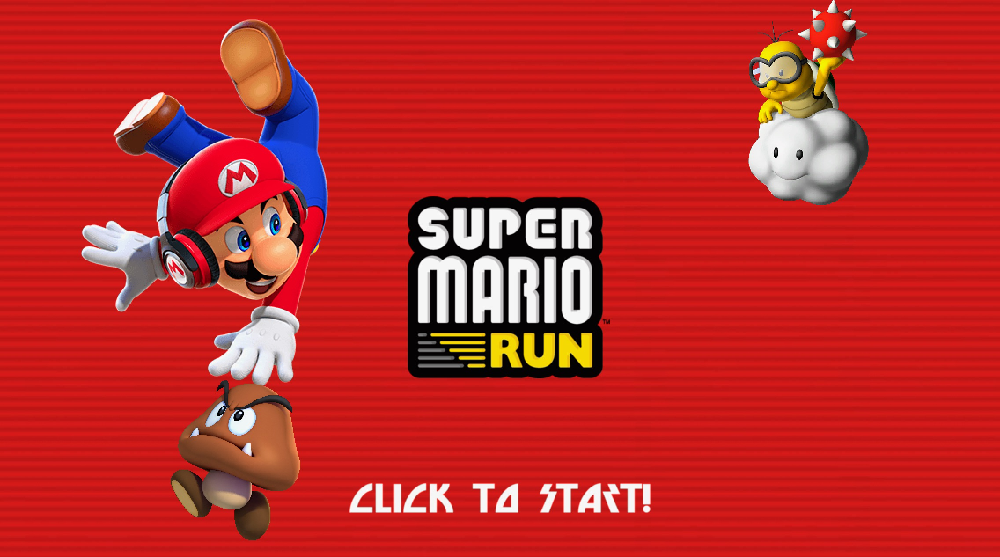
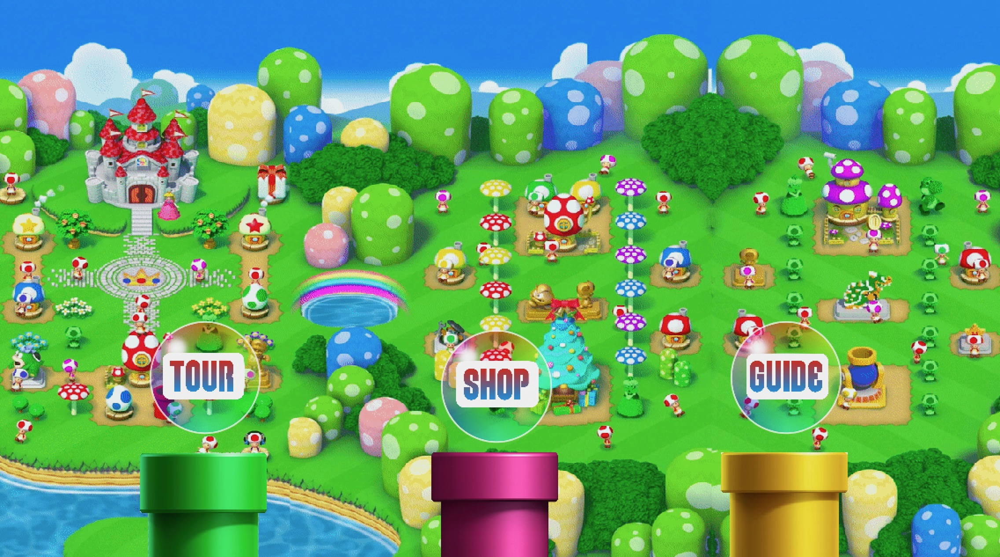
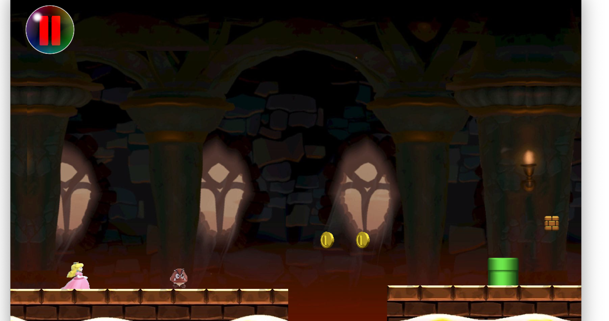
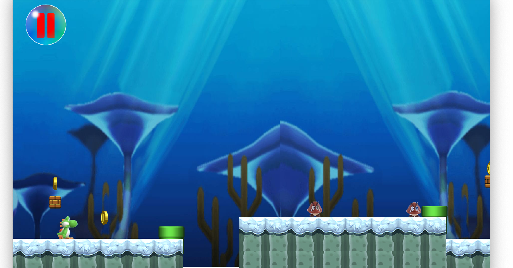

[![Contributors][contributors-shield]][contributors-url] 
[![MIT License][license-shield]][license-url]
[![LinkedIn][linkedin-shield]][linkedin-url]
 

<h1 align='center' >Super Mario Run</h1>

A fun side-scrolling platformer written in Java based on the original Super Mario Run game for iOS!

<h2 style="display: inline-block">Table of Contents</h2>

- [About The Project](#about)
- [Screenshots](#screenshots)
- [Minimum Requirements](#min)
- [Getting Started](#start)
- [License](#license)
- [Acknowledgements](#ack)

<h2 id='about'>About The Project</h2>

This project is based on the original 2016 Super Mario Run mobile game developed by Nintendo for iOS.
Super Mario Run is a side-scrolling platformer which consists of three levels. As Mario, Luigi, or Peach
automatically run across the world, the player controls them by timing the jumps to kill enemies, dodge environmental obstacles, and collect
coins to purchase new characters or power ups. This game also consists of a developer mode which was created with the intention
of making it easier for devs to determine object placement coordinates while creating a new level.

<h2 id='screenshots'>Screenshots</h2>
<h3>Start Screen</h3>

<h3>Main Menu</h3>

<h3>World Tour</h3>

<h3>World 2</h3>

<h3>World 3</h3>

<h2 id='min'>Minimum Requirements</h2>
CPU: Mediatek MT6582M Quad Core 1.6 GHz or equivalent 
GPU: ARM Mali-400 or equivalent 
RAM: 1 GB 
Storage: 500 MB 
Display: LCD Color Display 
OS: Windows 10 version 1507/macOS 10.14 Mojave (Liberty)

[Java SE 8](https://www.oracle.com/java/technologies/javase-downloads.html)

<h2 id='start'>Getting Started</h2>
Import this project into Eclipse IDE and run the mainSMR.java file

<h2 id='ack'>Acknowledgements</h2>

* [Nintendo Co., Ltd.](http://nintendo.com)

<h2 id='license'>License</h2>

Distributed under the MIT License.

[contributors-shield]: https://img.shields.io/github/contributors/othneildrew/Best-README-Template.svg?style=for-the-badge
[contributors-url]: https://github.com/i0nics/super-mario-run/graphs/contributors
[license-shield]: https://img.shields.io/github/license/othneildrew/Best-README-Template.svg?style=for-the-badge
[license-url]: https://github.com/i0nics/super-mario-run/blob/master/LICENSE
[linkedin-shield]: https://img.shields.io/badge/-LinkedIn-black.svg?style=for-the-badge&logo=linkedin&colorB=555
[linkedin-url]: https://linkedin.com/in/bikramce
