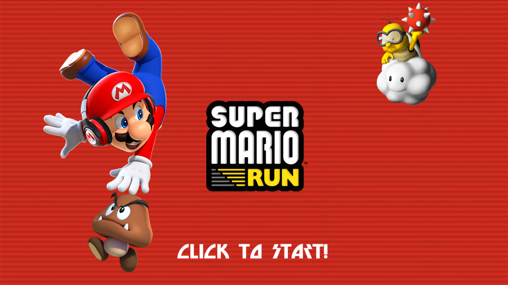
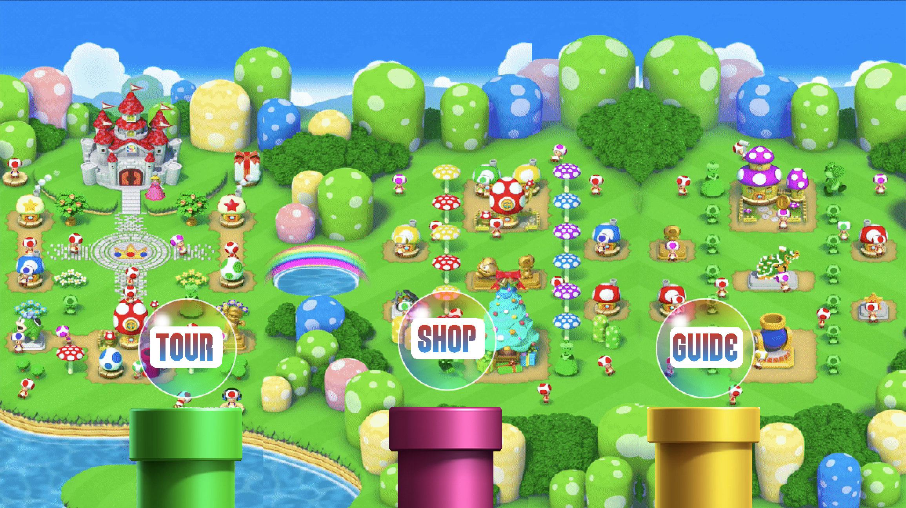
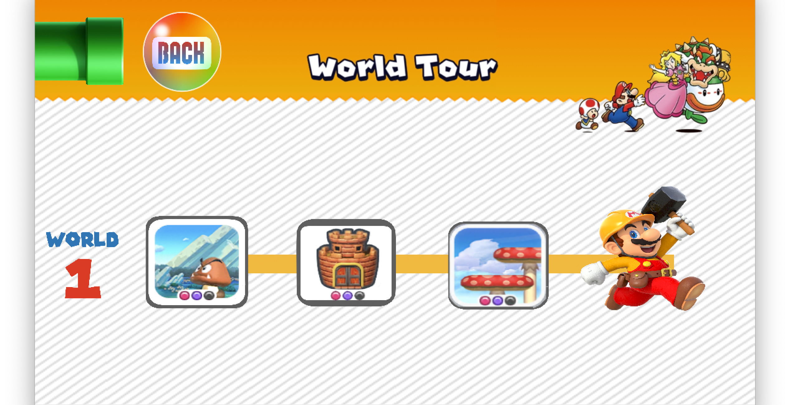
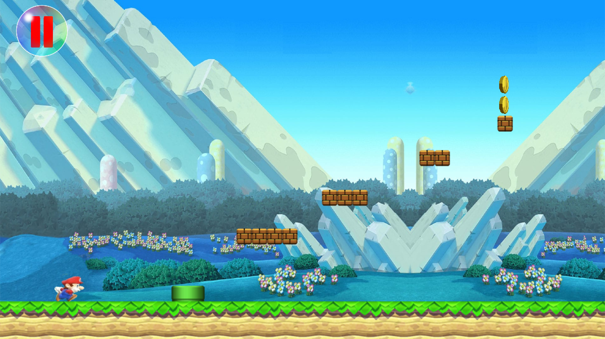
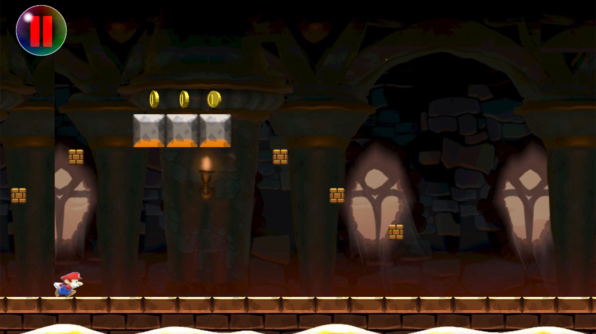
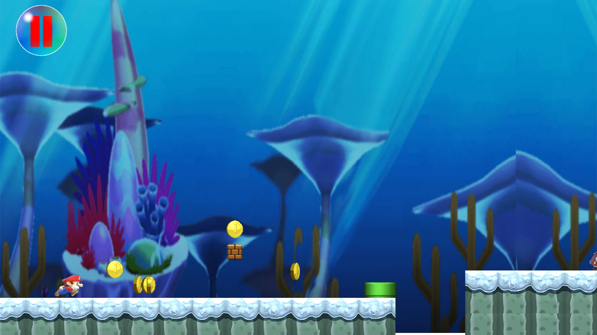
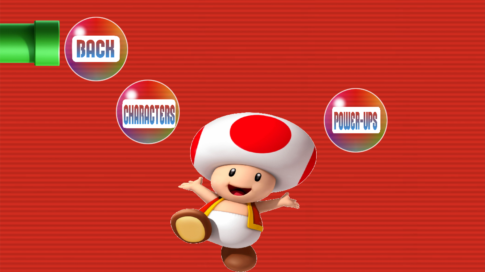
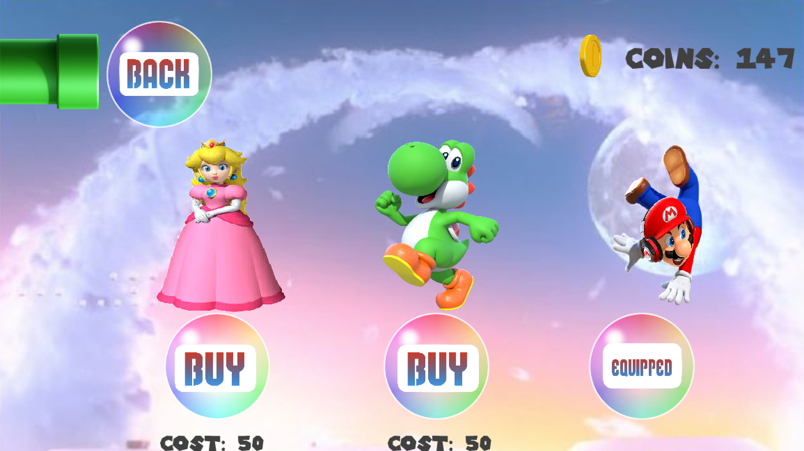
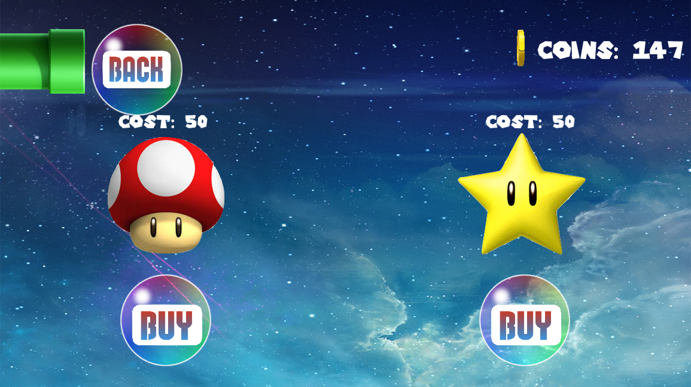
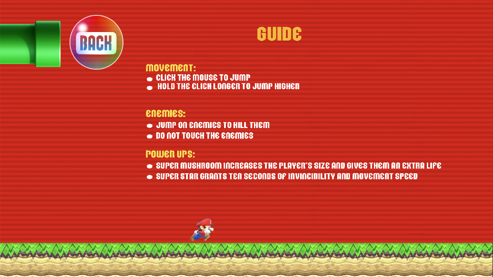

[![Contributors][contributors-shield]][contributors-url] 
[![MIT License][license-shield]][license-url]
[![LinkedIn][linkedin-shield]][linkedin-url]
<br>

<p align="center">
</p>
<h1 align='center' >Super Mario Run</h1>
<p align='center'>A fun side-scrolling platformer written in Java based on the original Super Mario Run game for iOS!</p>
<summary><h2 style="display: inline-block">Table of Contents</h2></summary>

- [About The Project](#about)
- [Additional Documentation](#doc)
- [New Goomba & Koopa Troopa Update](#update)
- [Screenshots](#screenshots)
- [Minimum Requirements](#min)
- [Getting Started](#start)
- [License](#license)
- [Acknowledgements](#ack)

<h2 id='about'>About The Project</h2>

This project is based on the original 2016 Super Mario Run mobile game developed by Nintendo for iOS.
Super Mario Run is a side-scrolling platformer which consists of three levels. As Mario, Luigi, or Peach
automatically run across the world, the player controls them by timing the jumps to kill enemies, dodge environmental obstacles, and collect
coins to purchase new characters or power ups. This game also consists of a developer mode which was created with the intention
of making it easier for devs to determine object placement coordinates while creating a new level.

<h2 id='doc'>Additional Documentation</h2>
<p>Please visit <a href='https://github.com/i0nics/super-mario-run/blob/master/Documentation.pdf'>Documentation.pdf</a> for additional project documentation containing use cases, UML class diagram, interaction diagrams, algorithms, and key accomplishments.</p>

<h2 id='update'>New Goomba & Koopa Troopa Update</h2>
<h3>Feature Overview</h3>
<p>The new update introduces Koop Troopa which are turtle-like creatures. Similar to Goombas, the player needs to stomp on top of them to knock them out.
 A new Enemy interface is also implemented for the previous Goomba class along with the new KoopaTroopa class. The speed of the enemies are also now dynamically implemented from a text file.
</p>

<h3>Pseudocode</h3>
<p>The Enemies interface contains common methods that are going to be used by the Goomba and KoopaTroopa Class</p>

```
interface Enemies
    updateBounds() Method that updates the location of invisible head and body GRectangles for collision detection
    Run() Method that initiates enemy and boundary movement and detects player collision
    getEnemy() Method that returns current enemy's GImage
    getEnemySpeed() Method that returns current enemy's speed from text file
```

<p>The KoopaTroopa class manages the location, movement, speed and collision detection of Koopa Troopa enemy</p>

```
class KoopaTroopa that implements the Enemies interface
    KoopaTroopa initialization constructor (main, levelPane, locationX, locationY)
        set program to main
        set level to levelPane
        set koopaTroopa to the image of koopaTroopa at location (locationX, locationY)
        initialize head to an invisible GRectangle object with appropriate height and width
        initialize body to an invisible GRectangle objectwith appropriate height and width
        
    // Update head and body GRectangles to appropriate locations surrounding the enemy's head and body
    updateBounds()
        set location of head GRectangle around enemy's head
        set location of body GRectangle around enemy's body
    
    // Retrieve enemy speed from text file
    getEnemySpeed()
        open text file
        set enemySpeed to first integer in text file and return
   
    // Return KoopaTroopa Image
    getEnemy()
        return KoopaTroopa image
      
    // Manage enemy movement and track enemy collision with player
    Run()
        if enemy is within 1000 pixels distance of the player
            move KoopaTroopa enemy at speed extracted from text file
            update KoopaTroopa's collision boundaries
        
        else
            move KoopaTroopa enemy at default speed
            update KoopaTroopa's collision boundaries
        
        if player has equipped star power up and player touches enemy
            kill KoopaTroopa enemy
        
        else if player has equipped mushroom power up and player touches enemy
            kill KoopaTroopa enemy
            reduce size of player
        
        else if player collides with enemy's head
            play stomp sound
            koopa troopa goes into his shell
       
        else if player collides with enemy's body
             kill player
 
```

<h2 id='screenshots'>Screenshots</h2>
<h3>Start Screen</h3>

<h3>Main Menu</h3>

<h3>World Tour</h3>

<h3>Level One</h3>

<h3>Level Two</h3>

<h3>Level Three</h3>

<h3>Shop</h3>

<h3>Characters</h3>

<h3>Power Ups</h3>

<h3>Guide</h3>

<h2 id='min'>Minimum Requirements</h2>
CPU: Mediatek MT6582M Quad Core 1.6 GHz or equivalent<br />
GPU: ARM Mali-400 or equivalent<br />
RAM: 1 GB<br />
Storage: 500 MB<br />
Display: LCD Color Display<br />
OS: Windows 10 version 1507/macOS 10.14 Mojave (Liberty)

[Java SE 8](https://www.oracle.com/java/technologies/javase-downloads.html)

<h2 id='start'>Getting Started</h2>
Import this project into Eclipse IDE and run the mainSMR.java file

<h2 id='ack'>Acknowledgements</h2>

* [Nintendo Co., Ltd.](http://nintendo.com)

<h2 id='license'>License</h2>
<p>Distributed under the MIT License.</p>

[contributors-shield]: https://img.shields.io/github/contributors/othneildrew/Best-README-Template.svg?style=for-the-badge
[contributors-url]: https://github.com/i0nics/super-mario-run/graphs/contributors
[license-shield]: https://img.shields.io/github/license/othneildrew/Best-README-Template.svg?style=for-the-badge
[license-url]: https://github.com/i0nics/super-mario-run/blob/master/LICENSE
[linkedin-shield]: https://img.shields.io/badge/-LinkedIn-black.svg?style=for-the-badge&logo=linkedin&colorB=555
[linkedin-url]: https://linkedin.com/in/bikramce
