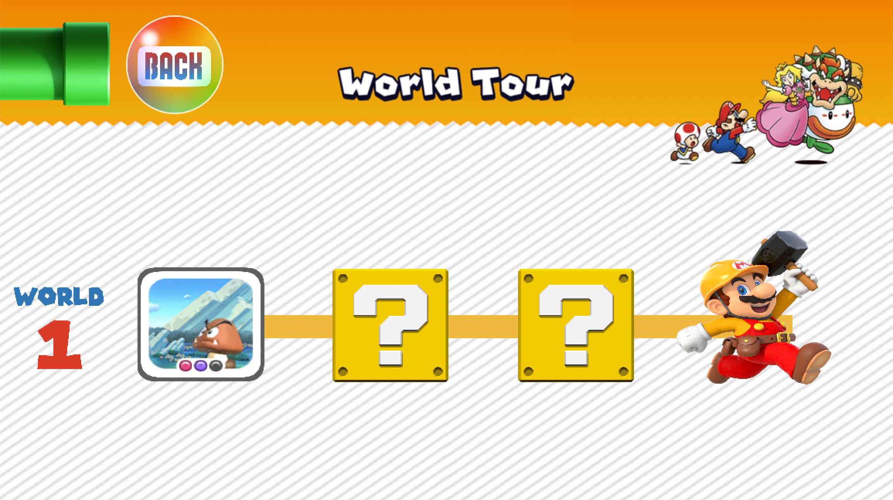

[![Contributors][contributors-shield]][contributors-url] 
[![MIT License][license-shield]][license-url]
[![LinkedIn][linkedin-shield]][linkedin-url]
<br>

<p align="center">
</p>
<h1 align='center' >Super Mario Run</h1>
<p align='center'>A fun side-scrolling platformer written in Java based on the original Super Mario Run game for iOS!</p>
<summary><h2 style="display: inline-block">Table of Contents</h2></summary>

- [About The Project](#about)
- [Additional Documentation](#doc)
- [New Enemy & Coin Tracker Update](#update)
- [Screenshots](#screenshots)
- [Minimum Requirements](#min)
- [Getting Started](#start)
- [License](#license)
- [Acknowledgements](#ack)

<h2 id='about'>About The Project</h2>

This project is based on the original 2016 Super Mario Run mobile game developed by Nintendo for iOS.
Super Mario Run is a side-scrolling platformer which consists of three levels. As Mario, Luigi, or Peach
automatically run across the world, the player controls them by timing the jumps to kill enemies, dodge environmental obstacles, and collect
coins to purchase new characters or power ups. This game also consists of a developer mode which was created with the intention
of making it easier for devs to determine object placement coordinates while creating a new level.

<h2 id='doc'>Additional Documentation</h2>
<p>Please visit <a href='https://github.com/i0nics/super-mario-run/blob/master/Documentation.pdf'>Documentation.pdf</a> for additional project documentation containing use cases, UML class diagram, interaction diagrams, algorithms, and key accomplishments.</p>

<h2 id='update'>New Enemy & Coin Tracker Update</h2>
<h3>Feature Overview</h3>
<p>The new update introduces Koop Troopa which are turtle-like creatures. Similar to Goombas, the player needs to stomp on top of them to knock them out.
A new Enemy interface is also implemented for a new merged Enemy class that handles the operation of both the original Goomba and the new Koopa Troopa. The speed of the enemies are also now dynamically implemented from a text file. Furthermore, every level now has a coin tracker on the top right which displays and dynamically updates the number of coins that are collected in the current level as the player progresses through it.
</p>

<h3>Pseudocode</h3>
<p>A) The Enemies interface contains methods that are going to be used in the Enemy Class</p>

```
interface Enemies
    updateBounds() Method that updates the location of invisible head and body GRectangles for collision detection
    Run() Method that initiates enemy and boundary movement and detects player collision
    getEnemySpeed() Method that returns current enemy's speed from text file
    getEnemyImage() Method that returns current enemy's image file
```

<p>B) The Enemy class manages the location, movement, speed and collision detection of desired enemy (Goomba or Koopa Troopa)</p>

```
class Enemy that implements the Enemies interface
    Enemy initialization constructor (main, levelPane, String enemyType, locationX, locationY)
        set program to main
        set level to levelPane
        set enemy type (Goomba or Koopa Troopa) to parameter enemyType
        set enemyImg to the image of enemy at location (locationX, locationY)
        initialize head to an invisible GRectangle object with appropriate height and width
        initialize body to an invisible GRectangle objectwith appropriate height and width
        set enemySpeed to the value extracted from text file returned by getEnemySpeed
        
    // Update head and body GRectangles to appropriate locations surrounding the enemy's head and body
    updateBounds()
        set location of head GRectangle around enemy's head
        set location of body GRectangle around enemy's body
    
    // Retrieve enemy speed from text file
    getEnemySpeed()
        open text file determined by enemy type
        set enemySpeed to first integer in text file and return
    
    // Return enemy image
    getEnemyImage() 
       return enemy image
      
    // Manage enemy movement and track enemy collision with player
    Run()
        if enemy is within 1000 pixels distance of the player
            move enemy at speed extracted from text file
            update enemy's collision boundaries
        
        else
            move enemy at default speed
            update enemy's collision boundaries
        
        if player has equipped star power up and player touches enemy
            kill enemy
        
        else if player collides with enemy's head
            play stomp sound
            kill enemy
       
        else if player collides with enemy's body
             kill player 
```
<p>C) The Constructor and actionPerformed methods in the LevelPane class are now used to implement a dynamic coin tracker</p>
   
```
LevelPane() 
    Initialize new coin counter GIF file at desired location in top-right of screen
    Initialize new coin counter label at desired location in top-right of screen and set it to current number of coins collected
    Set color of GLabel to white

ActionPerformed()
    check if character has collected coin and update current number of coins collected accordingly
    Update coin counter label to current number of coins collected
```

<h2 id='screenshots'>Screenshots</h2>
<h3>Start Screen</h3>

<h3>Main Menu</h3>

<h3>World Tour</h3>

<h3>Level One</h3>

<h3>Level Two</h3>

<h3>Level Three</h3>

<h3>Shop</h3>

<h3>Characters</h3>

<h3>Power Ups</h3>

<h3>Guide</h3>

<h2 id='min'>Minimum Requirements</h2>
CPU: Mediatek MT6582M Quad Core 1.6 GHz or equivalent<br />
GPU: ARM Mali-400 or equivalent<br />
RAM: 1 GB<br />
Storage: 500 MB<br />
Display: LCD Color Display<br />
OS: Windows 10 version 1507/macOS 10.14 Mojave (Liberty)

[Java SE 8](https://www.oracle.com/java/technologies/javase-downloads.html)

<h2 id='start'>Getting Started</h2>
Import this project into Eclipse IDE and run the mainSMR.java file

<h2 id='ack'>Acknowledgements</h2>

* [Nintendo Co., Ltd.](http://nintendo.com)

<h2 id='license'>License</h2>
<p>Distributed under the MIT License.</p>

[contributors-shield]: https://img.shields.io/github/contributors/othneildrew/Best-README-Template.svg?style=for-the-badge
[contributors-url]: https://github.com/i0nics/super-mario-run/graphs/contributors
[license-shield]: https://img.shields.io/github/license/othneildrew/Best-README-Template.svg?style=for-the-badge
[license-url]: https://github.com/i0nics/super-mario-run/blob/master/LICENSE
[linkedin-shield]: https://img.shields.io/badge/-LinkedIn-black.svg?style=for-the-badge&logo=linkedin&colorB=555
[linkedin-url]: https://linkedin.com/in/bikramce
